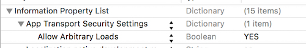

# TTBannerView
&nbsp;
&nbsp;

 
一个简单的滚动广告栏，图片来源可以选择本地或者网络，可以添加标题和分页控件

 
## 样式截图Screenshots

## 安装&使用
###  安装

#### 手动安装

你可以手动地把项目下的 `TTBannerView` 的文件拷贝到你的项目中使用，该项目依赖 [SDWebImage](https://github.com/rs/SDWebImage)，需要添加：

	pod 'SDWebImage'

#### Cocoapods
使用Cocoapods，只需要添加：

	pod 'TTBannerView'
	
	
###  使用
因为安全问题，http访问需要修改 `info.plist` 文件：

#### 代码

	//使用本地图片
	NSArray<NSString*>* localImgArray = @[@"1.jpg",@"2.jpg",@"3.jpg",@"4.jpg"];
    
    NSArray<NSString*>* titleArray1 = @[@"南京列入中国文化名城 金陵四大好景推荐",
                                        @"环游世界：越惊险越美丽 奇特火山美景",
                                        @"震后三年 四条线路带你看尽成都美景",
                                        @"从西安出发 11月一睹秋末最压轴美景"];
    
    TTBannerView *ttbv1 = [[TTBannerView alloc]initWithFrame:CGRectMake(0, 0, self.view.frame.size.width, 200) type:TitleCentralAlign localImgArray:localImgArray titleArray:titleArray1 pageIndicatorTintColor:[UIColor whiteColor] currentPageIndicatorTintColor:[UIColor greenColor] timerInterval:2.0f delegate:self];
    
    [self.view addSubview:ttbv1];
    
    
    
    
    //使用网络图片
    NSArray *imgURLArray = @[@"http://5.66825.com/download/pic/000/326/77066009f039bb215b3ab09c9297356a.jpg",
                             @"http://i1.download.fd.pchome.net/t_960x600/g1/M00/09/17/ooYBAFO-BwWIW4pnAAHU7t-Cj6gAABu2wKKJkAAAdUG122.jpg",
                             @"http://newpaper.dahe.cn/hnrb/images/2012-10/30/05/hnrb20121030b005cb008.jpg",
                             @"http://img1.3lian.com/img013/v2/63/d/1.jpg"];
    
    NSArray<NSString*>* titleArray2= @[@"野外夕阳美景摄影图片",
                                       @"超高清海岸美景电脑桌面壁纸",
                                       @"10月27日，壮乡广西河池市东兰县武篆镇秋色迷人",
                                       @"夕阳下的美景图片"];
    
    
    TTBannerView *ttbv2 = [[TTBannerView alloc]initWithFrame:CGRectMake(0, 240, self.view.frame.size.width, 200) type:TitleLeftAlign imgURLArray:imgURLArray placeholderImage:nil titleArray:titleArray2 pageIndicatorTintColor:[UIColor whiteColor] currentPageIndicatorTintColor:[UIColor grayColor] timerInterval:3.0f click:^(NSInteger imgIndex) {
        NSLog(@"you click: %ld",(long)imgIndex);
    }];
    
    [self.view addSubview:ttbv2];
    
#### 样式参数：

	/**
     * 只显示滚动图片
     */
    OnlyPic,
    /**
     *  显示滚动图片的分页控件，不添加标题
     */
    Normal,
    /**
     * 分页控件和标题都显示，标题居中
     */
    TitleCentralAlign,
    /**
     * 分页控件和标题都显示，标题居左
     */
    TitleLeftAlign,
    /**
     * 分页控件和标题都显示，标题居右
     */
    TitleRightAlign
### 版本
- 0.0.2 修复使用UINavigationController后导致UIScrollView尺寸变化
- 0.0.1 初始版本，支持本地和网络图片
####  问题&反馈
- QQ ：364432355
- E-mail ： whtacm@gmail.com